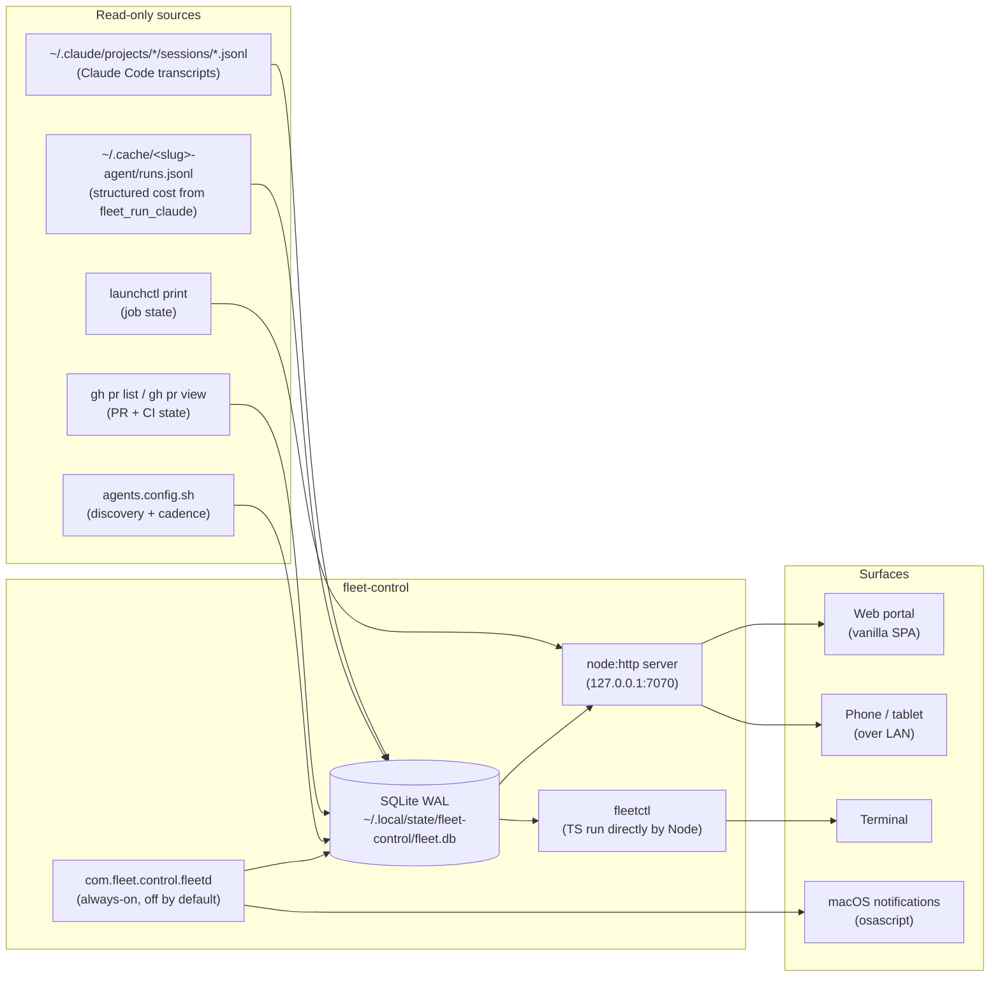

# fleet-control

> **A local cockpit for the autonomous agent fleet. See it. Steer it. Expand it. From any device on your network.**

`fleet-control` is a tiny zero-dependency Node app that watches the [`agent-fleet`](https://github.com/mutaaf/agent-fleet) kit running on your laptop. It discovers your projects, ingests their session transcripts + run logs into a local SQLite database, and serves a web portal (and a CLI) that turns "what are 12 launchd jobs across 4 repos doing right now?" into a single dashboard.

The cockpit does not call the model. Every number you see comes from reading local files, running `launchctl print`, or asking `gh`. That makes it cheap, fast, offline-friendly, and incapable of accidentally running up a bill.

> Sister project: **[agent-fleet](https://github.com/mutaaf/agent-fleet)** — the engine that runs the agents this app monitors.

---

## Table of contents

- [Why this exists](#why-this-exists)
- [Mental model in 60 seconds](#mental-model-in-60-seconds)
- [Prerequisites](#prerequisites)
- [Quickstart](#quickstart)
- [The web portal — a tour](#the-web-portal--a-tour)
- [`fleetctl` — the CLI](#fleetctl--the-cli)
- [Server routes — the HTTP API](#server-routes--the-http-api)
- [Control actions — the management surface](#control-actions--the-management-surface)
- [LAN access + auth](#lan-access--auth)
- [The always-on daemon](#the-always-on-daemon)
- [Alerts](#alerts)
- [SQLite schema — what's in the database](#sqlite-schema--whats-in-the-database)
- [Pricing — how the dollar numbers are computed](#pricing--how-the-dollar-numbers-are-computed)
- [Configuration reference](#configuration-reference)
- [File layout](#file-layout)
- [Troubleshooting](#troubleshooting)
- [FAQ](#faq)
- [Limitations + open items](#limitations--open-items)

---

## Why this exists

The `agent-fleet` kit deploys autonomous agents into multiple repos. After three projects and four phases per project, the question stopped being "are my agents working?" and became "**which** of these 12 jobs across these 4 repos is currently spending tokens, and on what?"

The fleet's own `bin/fleet status` answers the static question well — installed, last run, open PRs, lessons. But it doesn't answer:

- What is `com.almanac.agent-ship` doing **right now**?
- How much have I burned this week, by project, by phase?
- Did the `chore/gtm-` PR from this morning ever merge?
- I'm sitting on the couch — can I approve that PR from my phone?
- Has any agent been hanging silently for 45 minutes?

`fleet-control` answers those.

---

## Mental model in 60 seconds



**Reads are layered:**
- Static metadata (projects, runs, PRs, costs) → SQLite, refreshed by ingest.
- Live state (is the job running right now? what tool is it calling?) → probed fresh on every HTTP request via `launchctl` + tailing the current transcript.

**Writes go through the management surface:** every "kickstart this job", "pause that phase", "merge that PR", "create this ticket" goes through `src/control.ts`, gets logged to a `control_audit` table, and shells out to `launchctl` / `gh` / `bash <kit>/lib/install.sh` via `execFileSync` (no shell-string interpolation, no injection risk).

---

## Prerequisites

| Requirement | Why |
|---|---|
| **macOS** | Uses `launchctl` for everything job-related |
| **Node ≥ 23** | We use `node:sqlite` (built-in, no external DB driver) and run TypeScript directly via type-stripping (no build step) |
| **`gh` CLI, authenticated** | All PR data and merge actions go through `gh` |
| **The `agent-fleet` kit installed and at least one project deployed** | Otherwise there's nothing to monitor |

There are zero npm dependencies. `package.json` has only an `engines` field. The web portal is vanilla ES6 — no React, no Vite, no bundler.

---

## Quickstart

**1. Clone**
```bash
git clone https://github.com/mutaaf/fleet-control ~/code/fleet-control
cd ~/code/fleet-control
```

**2. Backfill the database**
```bash
npm run backfill
```
This walks `~/Desktop/projects/*` looking for `agents.config.sh`, then ingests every `~/.claude/projects/*-agent-checkout/*.jsonl` transcript and every `~/.cache/<slug>-agent/runs.jsonl` cost record. First run on a real fleet typically takes 5–20 seconds and ingests a few hundred runs.

**3. See the fleet in the terminal**
```bash
npm run status
```
You'll see one row per project with totals: runs, tokens, estimated $, last run time.

**4. Start the server**
```bash
node bin/fleetctl.ts serve
```
It prints something like:
```
fleet-control serving on http://127.0.0.1:7070
admin token (for LAN pairing): <hex>   (printed once; stored in fleet-control.config.json)
```

**5. Open the portal**
```
http://localhost:7070
```

That's the loop. The rest of this README is about everything you can do once it's running.

---

## The web portal — a tour

Vanilla ES6 SPA. Hash routing. No build step — `web/` is served directly by `node:http`.

**Plain-language labels** (so a non-engineer can read it):

| Phase (internal) | Label in the UI |
|---|---|
| `ship` | "Builds features" |
| `groom` | "Comes up with ideas" |
| `review` | "Checks the work" |
| `eng` | "Tidies the code" |

**Outcome labels:**

| Outcome | Label |
|---|---|
| `shipped` | "shipped a feature" |
| `healed` | "fixed the last work" |
| `no-op` | "nothing to do" |
| `reviewed-ok` | "checked — looks good" |
| `reviewed-changes` | "sent work back" |
| `self-cancel` | "stopped (limit)" |

### Routes

| URL | What it shows |
|---|---|
| `#/` | **Home.** One card per project. Total cost across the fleet. Daemon toggle. Open alerts. |
| `#/p/<slug>` | **Project.** Each job (with run-now / pause / resume), the most recent runs, the open agent PRs (with approve / send-back / discard), and the "Tell it what to build" button. |
| `#/r/<id>` | **Run trace.** Single run detail. Token breakdown by class. Tool-call timeline (each tool_use → tool_result pair). |

### Panels you'll use

- **Project card (home).** State badge — Working / Idle / Paused / Stopped. Last outcome + cost. ETA of next scheduled fire. A row of 16 colored dots for the last 16 outcomes — instant "is this project healthy?" signal.
- **Job card (project page).** Phase name in plain language. "Run now" (`launchctl kickstart`). Pause / Resume (`launchctl disable` / `enable`). Last outcome line. Next-fire ETA.
- **PRs section (project page).** Only agent PRs (matched by branch prefix). Title, CI state (green check / red X / pending dot), ±lines. Three buttons: **Approve & publish** (`gh pr merge --auto --squash`), **Send back** (`gh pr review --request-changes` with a free-text note), **Discard** (`gh pr close`). Plus a "View on GitHub" link.
- **"Tell it what to build" modal.** Plain-language wizard that creates a backlog ticket in your repo: title → user story, "done when" lines → acceptance criteria, importance → P0 / P1 / P2. The server clones the repo, writes `docs/backlog/NNNN-*.md`, syncs the README index row, validates with `check-backlog.mjs`, pushes a `chore/gtm-tkt-NNNN` branch, opens a PR. Your `ship` agent picks the ticket up on its next fire.
- **"Add a project" modal.** Path-A onboarding wizard. Point it at an existing repo folder; it scaffolds `agents.config.sh`, the `AGENTS.md § Agent parameters` section, `docs/backlog/{README,_template}.md`, `scripts/check-backlog.mjs`, then runs `<kit>/lib/install.sh` to register the launchd jobs.

---

## `fleetctl` — the CLI

Every UI action has a CLI equivalent. Invoke as `node --disable-warning=ExperimentalWarning bin/fleetctl.ts <cmd>` (or `npm run fleetctl -- <cmd>`).

| Command | Argument | What it does |
|---|---|---|
| `backfill` | — | Ingest transcripts + runs + PRs into SQLite. Recompute daily cost rollups. Print fleet status. |
| `status` | — | Print the fleet cost board (all projects, runs, tokens, est. cost, last run). |
| `runs` | `<slug>` | Print the 30 most recent runs for a project (id, phase, when, duration, tokens, cost, outcome). |
| `show` | `<id>` | Full detail of a single run: stats, summary, up to 60 tool events. |
| `serve` | — | Start the HTTP server on the host/port from config (default `127.0.0.1:7070`). |
| `daemon` | `on` / `off` | Install or uninstall the always-on launchd monitoring job. |
| `daemon-run` | `[interval]` | The long-running loop launchd actually executes (you typically don't call this directly). |
| `alerts` | — | List currently open alerts (critical + warnings). |

Examples:

```bash
node bin/fleetctl.ts backfill                      # ingest + recompute
node bin/fleetctl.ts status                         # fleet board
node bin/fleetctl.ts runs courtiq                   # 30 most recent
node bin/fleetctl.ts show 1837                      # one run's full trace
node bin/fleetctl.ts serve                          # web portal
node bin/fleetctl.ts daemon on                      # always-on monitoring
node bin/fleetctl.ts alerts                         # open alerts
```

---

## Server routes — the HTTP API

Everything is JSON. Loopback is fully trusted; LAN requires an `x-fleet-token` header.

### Read

| Method | Path | Returns |
|---|---|---|
| `GET` | `/api/fleet` | Whole-fleet summary: every project, totals (runs/tokens/cost), open alerts, daemon on/off. |
| `GET` | `/api/project/<slug>` | One project: jobs (with live state), recent runs, cost by phase, open PRs. |
| `GET` | `/api/run/<id>` | One run: detail, events (tool_use + tool_result), project metadata. |
| `GET` | `/api/whoami` | `{ loopback: bool, needsToken: bool }` — used by the SPA to know whether to prompt for pairing. |
| `GET` | `/` | The vanilla SPA (`index.html`, `app.js`, `style.css`). |

Read endpoints refresh stale data inline (max once every 10s if the daemon is off), so the UI always reflects something current without you running `backfill`.

**Public artifact surfaces** (no auth, paste-friendly URLs): `/pulse`, `/receipts`, `/year`, `/calculator`, `/failures`, `/lessons-public`, `/lessons-public/<slug>` (one lesson permalink), `/lessons-public/<slug>/lineage` (timeline of every project that lesson has caught a re-occurrence in, plus a 1200x630 OG card at `/og/lessons-public/<slug>/lineage.svg`), and — new in ticket 0068 — `/referrals/<handle>` (the operator-to-operator referral graph: who introduced N operators to fleet-control, with anonymised tiles for downstream operators that have not opted into public credit).

### Operator referrals

The new operator who installed fleet-control because of an upstream operator's recommendation opts into the referral graph by adding one nested object to `fleet-control.config.json`:

```json
{
  "operator": {
    "handle": "alice",
    "sinceDate": "2026-03-01",
    "referredBy": {
      "handle": "mutaaf",
      "acknowledgedAt": "2026-06-19",
      "consentPublicCredit": true
    }
  }
}
```

On the next `fleetctl serve` boot the daemon writes one local `snapshot` row of `kind='referral_ack'` carrying `{ upstream: "mutaaf", downstream: "alice", acknowledgedAt, consentPublicCredit, version: 1 }`. The row is local to the new operator's DB — there is NO network call to the upstream operator's instance. The upstream operator's `/referrals/mutaaf` page is therefore a LOCAL VIEW of the upstream's own DB. The upstream operator's `/operator/mutaaf` page grows a fifth stat block "N operators introduced to fleet-control" that links to the referral graph.

`consentPublicCredit` defaults to `false`: the downstream operator's real handle stays anonymised (rendered as a SHA-256 placeholder) on the upstream's page unless the downstream explicitly opts in. The opt-in flips the placeholder to the downstream's real handle so the chain is browseable.

### Write

| Method | Path | Body | Action |
|---|---|---|---|
| `POST` | `/api/control/<action>` | JSON | See [Control actions](#control-actions--the-management-surface) |

---

## Control actions — the management surface

All hit `POST /api/control/<action>` with a JSON body. Every call is logged to the `control_audit` table with actor (`local` or `lan`), shelled command, exit code, and the tail of stdout.

| Action | Body | What it does |
|---|---|---|
| `kickstart` | `{ slug, phase }` | `launchctl kickstart -k gui/<UID>/com.<slug>.agent-<phase>` — run the job now. |
| `pause` | `{ slug, phase? }` | `launchctl disable` for one job or all four. |
| `resume` | `{ slug, phase? }` | `launchctl enable` for one job or all four. |
| `keep-running` | `{ slug, days? }` | Edit `agents.config.sh` to bump `SELF_CANCEL` by N days (default 14), then re-run `install.sh`. Refuses to run if any job is currently firing (so it doesn't restart mid-flight). |
| `eng-toggle` | `{ slug, enabled }` | Edit `agents.config.sh` `ENG_ENABLED`, re-run `install.sh`. Same guard as keep-running. |
| `pr-merge` | `{ slug, number }` | `gh pr merge --auto --squash` — "Approve & publish". |
| `pr-changes` | `{ slug, number, note }` | `gh pr review --request-changes --body <note>` — "Send back". |
| `pr-close` | `{ slug, number }` | `gh pr close` — "Discard". |
| `create-ticket` | `{ slug, title, story?, criteria[], priority?, area?, idea? }` | Temp-clone the repo, write `docs/backlog/NNNN-*.md` + sync index row, validate with `check-backlog.mjs`, branch `chore/gtm-tkt-NNNN`, push, `gh pr create`. |
| `register` | `{ path, name?, days?, eng? }` | Scaffold `agents.config.sh` + `AGENTS.md § Agent parameters` + `docs/backlog/` + `scripts/check-backlog.mjs`, then run `<kit>/lib/install.sh`. |
| `daemon` | `{ enabled, interval? }` | Install or uninstall `com.fleet.control.fleetd`. |

Every shell-out uses `execFileSync(argv0, [args])` — never `exec(string)` — so user-supplied values (PR numbers, ticket titles, paths) cannot be turned into shell injection.

---

## LAN access + auth

By default the server binds to `127.0.0.1`. To use it from your phone or tablet:

**1. Edit `fleet-control.config.json`:**
```json
{
  "host": "0.0.0.0",
  "port": 7070
}
```

**2. Restart `fleetctl serve`.** It prints the admin token to the terminal.

**3. On your phone**, open `http://<laptop-ip>:7070`. The SPA detects it's not loopback, prompts for a token, and stores it in `localStorage`. From then on every request sends `x-fleet-token: <hex>`.

**Security model:**
- Loopback requests (`127.0.0.1`, `::1`, `::ffff:127.0.0.1`) are fully trusted with no token. This is what makes development friction-free.
- Anything else requires the token, compared in constant time (`crypto.timingSafeEqual`) to defeat timing attacks.
- The token is auto-generated as 24 random hex bytes on first server start, stored in `fleet-control.config.json` (git-ignored), and never logged on disk. If you rotate it, just delete the line and restart — a new one is generated.

This is intentionally a tiny, single-user model. The portal has read/write access to your repos via `gh` and can edit your `agents.config.sh` and run `install.sh` — only expose it on a LAN you trust.

---

## The always-on daemon

`fleet-control` works fine as a foreground server (`fleetctl serve`). The daemon is for when you want it monitoring 24/7 with notifications.

**Enable:**
```bash
node bin/fleetctl.ts daemon on
```

This writes `~/Library/LaunchAgents/com.fleet.control.fleetd.plist` and bootstraps it. The launchd job runs `daemon-run` in a loop (default 60s interval): ingest, evaluate alerts, fire macOS notifications, repeat.

**Disable:**
```bash
node bin/fleetctl.ts daemon off
```

Boots out and removes the plist. Open / dismissed alerts in the database stay where they are.

**Logs:**
- `~/.local/state/fleet-control/logs/fleetd.out`
- `~/.local/state/fleet-control/logs/fleetd.err`

**One caveat:** the daemon currently runs Node against the script at `~/code/fleet-control/...`. If that path falls under macOS TCC (e.g. `~/Desktop`), the launchd job may need Full Disk Access for Node. The `agent-fleet` kit avoids this by copying itself to `~/.local/share/`; `fleet-control` doesn't do that yet. Workaround: clone to `~/code/` (not `~/Desktop/`), or grant Node FDA in System Settings → Privacy & Security → Full Disk Access.

---

## Alerts

Evaluated at the end of every ingest pass. Each is dedupe-keyed so the same condition notifies once per window, not on every tick.

| Rule | Trigger | Severity |
|---|---|---|
| **Self-cancel approaching** | days remaining ≤ 3 | warn |
| **Self-cancel passed** | days remaining < 0 | critical |
| **Hung run** | `ship` / `eng` running > 15m, `groom` > 45m, `review` > 8m | warn |

Notifications use `osascript display notification` with sound "Submarine". If `osascript` is unavailable (non-mac, sandboxed), alerts still surface in the UI and the `alerts` CLI command — just no OS-level toast.

List the current set:
```bash
node bin/fleetctl.ts alerts
```

The home page of the portal shows a banner with the open count, and clicking through opens the project that triggered each one.

---

## SQLite schema — what's in the database

WAL mode. `synchronous=NORMAL`. Foreign keys on. Single writer; readers never block. Path defaults to `~/.local/state/fleet-control/fleet.db` (override with `dbPath` in the config).

<details>
<summary><b>Tables (click to expand)</b></summary>

```sql
-- Identity for every project the kit knows about.
CREATE TABLE project (
  id INTEGER PRIMARY KEY,
  slug TEXT UNIQUE NOT NULL,
  name TEXT,
  namespace TEXT NOT NULL,
  repo_url TEXT, repo_owner TEXT, repo_name TEXT,
  model TEXT DEFAULT 'claude-opus-4-7',
  self_cancel TEXT,
  eng_enabled INTEGER DEFAULT 0,
  manifest_path TEXT,
  cadence_json TEXT,
  first_seen_at TEXT, last_seen_at TEXT
);

-- Legacy slugs (e.g. dca → digitalcraft, sportsiq → courtiq) so historical
-- cache dirs still attribute correctly.
CREATE TABLE project_alias (
  project_id INTEGER REFERENCES project(id),
  alias_slug TEXT PRIMARY KEY,
  kind TEXT  -- "current" | "legacy-cache"
);

CREATE TABLE agent (
  id INTEGER PRIMARY KEY,
  project_id INTEGER REFERENCES project(id),
  phase TEXT NOT NULL,  -- ship | groom | review | eng
  launchd_label TEXT NOT NULL,
  UNIQUE(project_id, phase)
);

-- One row per agent invocation.
CREATE TABLE run (
  id INTEGER PRIMARY KEY,
  project_id INTEGER REFERENCES project(id),
  phase TEXT NOT NULL,
  session_id TEXT,
  started_at TEXT, ended_at TEXT,
  duration_ms INTEGER,
  exit_code INTEGER,
  num_turns INTEGER,
  input_tokens INTEGER DEFAULT 0,
  output_tokens INTEGER DEFAULT 0,
  cache_creation_tokens INTEGER DEFAULT 0,
  cache_read_tokens INTEGER DEFAULT 0,
  cost_usd REAL,
  cost_usd_computed REAL,
  cost_source TEXT,           -- "live" (from runs.jsonl) overrides "computed" (from tokens × pricing)
  model TEXT,
  summary TEXT,
  outcome TEXT,               -- shipped | healed | no-op | reviewed-ok | reviewed-changes | self-cancel | smoke
  pr_number INTEGER,
  transcript_path TEXT, log_path TEXT,
  source TEXT,                -- "transcript" | "runs.jsonl"
  UNIQUE(project_id, phase, session_id)
);

-- Tool-call timeline within each run.
CREATE TABLE run_event (
  id INTEGER PRIMARY KEY,
  run_id INTEGER REFERENCES run(id) ON DELETE CASCADE,
  seq INTEGER, ts TEXT,
  kind TEXT,                  -- "tool_use" | "tool_result"
  tool_name TEXT, tool_use_id TEXT,
  input_summary TEXT, output_summary TEXT, is_error INTEGER DEFAULT 0
);

-- Cheap daily rollups for the cost board.
CREATE TABLE cost_rollup_day (
  project_id INTEGER, phase TEXT, day TEXT,
  runs INTEGER,
  input_tokens INTEGER, output_tokens INTEGER,
  cache_creation_tokens INTEGER, cache_read_tokens INTEGER,
  cost_usd REAL,
  PRIMARY KEY(project_id, phase, day)
);

CREATE TABLE pricing (
  model TEXT PRIMARY KEY,
  input_per_mtok REAL, output_per_mtok REAL,
  cache_write_per_mtok REAL, cache_read_per_mtok REAL,
  note TEXT
);

-- Idempotent ingest — we skip files we've already digested.
CREATE TABLE ingested_file (
  path TEXT PRIMARY KEY,
  size INTEGER, mtime TEXT, complete INTEGER,
  run_id INTEGER, ingested_at TEXT
);

CREATE TABLE watermark (
  source TEXT PRIMARY KEY, cursor TEXT, updated_at TEXT
);

-- PR snapshot, refreshed via `gh` (60s TTL).
CREATE TABLE pr (
  project_id INTEGER, number INTEGER, title TEXT, branch TEXT,
  state TEXT, ci_state TEXT, merge_state TEXT,
  is_agent INTEGER,
  additions INTEGER, deletions INTEGER, author TEXT, url TEXT,
  fetched_at TEXT,
  PRIMARY KEY(project_id, number)
);

-- Every control action (kickstart / pause / merge / etc).
CREATE TABLE control_audit (
  id INTEGER PRIMARY KEY, ts TEXT,
  actor TEXT, action TEXT, target TEXT, args_json TEXT,
  exit_code INTEGER, stdout_tail TEXT
);

CREATE TABLE alert (
  id INTEGER PRIMARY KEY,
  project_id INTEGER, phase TEXT,
  type TEXT, severity TEXT,
  title TEXT, detail TEXT,
  dedup_key TEXT UNIQUE,
  created_at TEXT, notified_at TEXT, resolved_at TEXT
);
```

</details>

---

## Pricing — how the dollar numbers are computed

Two sources, layered:

**1. Live (preferred).** When the `agent-fleet` kit's `fleet_run_claude` records a run to `~/.cache/<slug>-agent/runs.jsonl`, it includes `total_cost_usd` directly from the `claude --print --output-format json` response. This is the exact number reported by the local CLI. We store this with `cost_source = 'live'`.

**2. Computed (fallback).** For runs ingested only via the Claude Code transcript (`~/.claude/projects/.../*.jsonl`), we sum token usage by class and apply per-model rates from the `pricing` table. Stored with `cost_source = 'computed'`.

Seeded default rates (USD per 1M tokens, in `src/pricing.ts`):

| Model | Input | Output | Cache write | Cache read |
|---|---|---|---|---|
| `claude-opus-4` | $15.00 | $75.00 | $18.75 | $1.50 |
| `claude-sonnet-4` | $3.00 | $15.00 | $3.75 | $0.30 |
| `claude-haiku-4` | $0.80 | $4.00 | $1.00 | $0.08 |

Matching uses longest prefix wins; unknown models fall back to opus. The values are configurable per-model in the `pricing` table.

**About the dollar sign:** the agents run on a Max subscription. The numbers in fleet-control represent *relative effort*, not invoices on your card. The right way to read them: "ship on courtiq cost about 3× a ship on almanac this week" → useful signal for where to optimize prompts; not "you owe Anthropic $42."

---

## Configuration reference

`fleet-control.config.json` (in the repo root, git-ignored). Auto-generated on first server start. Override only what you need; defaults fill the rest.

```jsonc
{
  // LAN auth token. Auto-generated 24-byte hex on first start.
  "adminToken": "...",

  // Where to look for repos. Each must contain agents.config.sh.
  "projectRoots": ["/Users/you/Desktop/projects"],

  // Where the kit caches per-project manifests (for projects whose working
  // tree is gone). Should match agent-fleet's install location.
  "installedRoot": "/Users/you/.local/share/agent-fleet/projects",

  // SQLite database path.
  "dbPath": "/Users/you/.local/state/fleet-control/fleet.db",

  // Per-project cache parent. Where ~/.cache/<slug>-agent/ lives.
  "cacheBase": "/Users/you/.cache",

  // Where Claude Code stores session transcripts.
  "claudeProjects": "/Users/you/.claude/projects",

  // HTTP server.
  "host": "127.0.0.1",     // "0.0.0.0" for LAN
  "port": 7070
}
```

---

## File layout

```
fleet-control/
├── README.md                              # you are here
├── package.json                           # zero runtime deps; just scripts
├── fleet-control.config.json              # generated; git-ignored
├── bin/
│   └── fleetctl.ts                        # the CLI entry point
├── src/
│   ├── config.ts                          # config loader, token generation
│   ├── discovery.ts                       # finds projects by agents.config.sh + git remote alias
│   ├── db.ts                              # SQLite schema + helpers
│   ├── pricing.ts                         # token → USD
│   ├── live.ts                            # launchctl + transcript-tail + cadence math
│   ├── views.ts                           # shape SQL rows for the UI
│   ├── server.ts                          # node:http server + auth
│   ├── control.ts                         # every write action (shells safely)
│   ├── daemon.ts                          # always-on launchd toggle
│   ├── alerts.ts                          # rule engine + osascript
│   └── ingest/
│       ├── index.ts                       # orchestrator
│       ├── transcripts.ts                 # parses Claude Code session JSONL
│       ├── runs.ts                        # overlays measured total_cost_usd
│       └── prs.ts                         # gh pr list with TTL cache
└── web/
    ├── index.html
    ├── app.js                             # vanilla ES6 SPA, hash routing
    └── style.css
```

Generated on disk (per-user):

```
~/.local/state/fleet-control/
├── fleet.db                               # SQLite (+ -wal / -shm)
└── logs/
    ├── fleetd.out
    └── fleetd.err

~/Library/LaunchAgents/
└── com.fleet.control.fleetd.plist         # only if daemon is on
```

---

## Troubleshooting

<details>
<summary><b>backfill prints "no projects found"</b></summary>

`discovery.ts` walks the dirs in `config.projectRoots` (default `~/Desktop/projects`) one level deep looking for `*/agents.config.sh`. If your projects live elsewhere:

```json
{ "projectRoots": ["/Users/you/code"] }
```

Restart and re-run `backfill`.
</details>

<details>
<summary><b>Costs look wrong / all zero</b></summary>

Two flavors:
- **All runs show $0** → the `pricing` table is empty or the model name doesn't match any prefix. `sqlite3 ~/.local/state/fleet-control/fleet.db "select * from pricing;"` to inspect; insert a row for the model you actually use.
- **Some runs are exact dollar amounts, others are rounded estimates** → that's working as intended. `cost_source = 'live'` is the exact CLI number; `'computed'` is tokens × pricing. Look at the run detail page to see which.
</details>

<details>
<summary><b>The portal can't reach the server from my phone</b></summary>

- Did you change `host` to `0.0.0.0` and restart? `lsof -iTCP:7070 -sTCP:LISTEN` should show `0.0.0.0:7070`, not `127.0.0.1:7070`.
- Is your laptop firewall blocking? System Settings → Network → Firewall.
- Are phone and laptop on the same Wi-Fi network? Many home routers isolate guest networks.
</details>

<details>
<summary><b>"Approve & publish" says it worked but the PR didn't merge</b></summary>

`gh pr merge --auto --squash` arms auto-merge; GitHub actually performs the merge once required checks are green. If the PR shows "Pending review from <other>" or "Required check X has not run", auto-merge is queued. The portal shows CI state on the PR card — if it's red or pending, the merge will wait.
</details>

<details>
<summary><b>The daemon won't start / log shows "Operation not permitted"</b></summary>

macOS TCC. Either move the repo out of `~/Desktop` (TCC-restricted) into `~/code` (not restricted), or grant Full Disk Access to your Node binary in System Settings → Privacy & Security → Full Disk Access. The agent-fleet kit dodges this by copying itself to `~/.local/share/`; fleet-control doesn't yet.
</details>

<details>
<summary><b>I see "live" cost as exact and "computed" as zero on a recent run</b></summary>

The transcript ingest happens before the runs.jsonl overlay. If you ingest mid-run, the transcript row will exist with `cost_source='computed'` and tokens summed so far. Next backfill it'll be overwritten with the live total. (Worst case: 1 run shows the wrong value briefly.)
</details>

<details>
<summary><b>fleetctl serve errors with "ExperimentalWarning"</b></summary>

That's just `node:sqlite` reminding you it's still experimental in the Node version. The flag in our `npm run` scripts suppresses it. If you're running `node bin/fleetctl.ts ...` directly, add `--disable-warning=ExperimentalWarning` (it's pinned in `package.json` for the npm scripts already).
</details>

---

## FAQ

**Why no React / Vue / Vite?** Zero deps was the goal. The whole portal is one HTML file, one JS file, one CSS file. No build, no install, no audit, no dependency drift. It will work in three years without touching it.

**Why TypeScript with no build step?** Node ≥ 23 ships type stripping. We get the editing experience of TS without the compile step or the `tsc --watch`. The trade-off: no advanced type features like decorators or namespaces. We don't need them.

**Why SQLite and not a JSON file?** Three reasons: WAL gives us concurrent reader safety while the daemon writes; SQL is the right tool for the dashboard queries (joins, group by, time-bucket); and `node:sqlite` is in the standard library now so the cost is zero deps.

**Why does this read transcripts AND runs.jsonl?** Backwards compatibility. Older `agent-fleet` runs didn't write `runs.jsonl` — the only record is the Claude Code transcript. After we landed `fleet_run_claude` in the kit, new runs write the structured record with exact cost. Old data still loads from transcripts.

**How do you tell ship from groom in a generic `checkout` transcript dir?** The transcript subdir is named after the cache dir, so `*-review-checkout` and `*-eng-checkout` self-identify. Bare `*-checkout` could be ship OR groom — we read the first user message and look for `"Ship runner"` (ship's prompt header) vs `"Innovation runner"` (groom's prompt header). Important nuance: do **not** match the bare word `groom` — it appears in the ship prompt for context, leading to false positives.

**Can I run fleet-control on something other than macOS?** The discovery, ingest, SQLite, server, and SPA all run anywhere. But every control action (`launchctl`, `osascript`) is mac-specific. On Linux you'd see all your historical data but couldn't act on it. PRs welcome to add a `systemctl` adapter.

**What's the actor field in `control_audit`?** `"local"` for loopback requests, `"lan"` for token-authenticated remote requests. So if you ever look back wondering "did I do that or did my phone?", the audit log knows.

**Does this app talk to Claude?** No. Zero LLM calls. Costs / tokens / outcomes are all computed from local files. The only network calls it makes are `gh` (which hits GitHub) and your browser fetching the portal.

**Can two people use the same portal at the same time?** Sure — the SPA is stateless and the server is fine with concurrent reads. They'd share one admin token, and each write action gets logged to `control_audit` with the actor field. (There's no per-user auth yet; if you need that, fork it.)

---

## Limitations + open items

- **Daemon under `~/Desktop` may need Full Disk Access.** Mirror the agent-fleet trick (copy to `~/.local/share/`) and this goes away.
- **Pricing is estimates** for any run without a live `total_cost_usd`. Confirm rates against the Anthropic console for your model and edit the `pricing` table if you care about absolute accuracy.
- **No remote-trigger queue.** Every control action is fire-and-wait. If `launchctl kickstart` hangs, the HTTP request hangs with it. (In practice this never happens; if it does, a kill switch in the UI would be a small add.)
- **No multi-user.** Single admin token. Fine for personal use; not fine for a team. If you need team RBAC, fork and add it before exposing publicly.
- **macOS-only writes.** See above.

---

## License

Personal toolkit. Use it, fork it, learn from it. No warranty.
